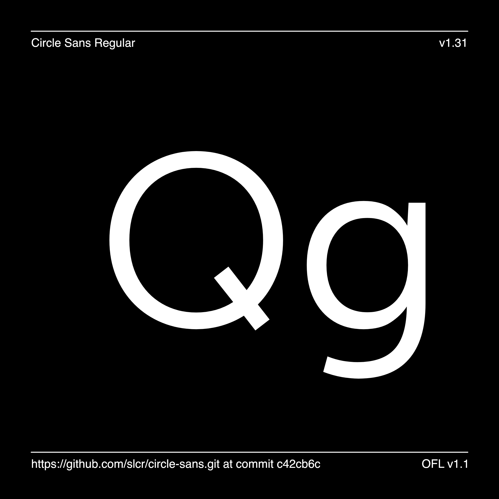

# Circle Sans

**Circle Sans** is a fork of [Albert Sans](https://github.com/usted/Albert-Sans) with two
deliberate differences. Everything else — outlines, spacing, kerning, figures, the `wght`
and `wdth` axes, the language coverage — is Albert Sans unchanged.

| Change | What it means |
|---|---|
| **New `Q`** | The tail is a diagonal stroke crossing the bowl at the lower right, replacing the centred vertical bar that read as the Quake logo. A fixed `−52°` at every weight and width. |
| **Frozen alternates** | The long-stem `g` and the open "et" ampersand are now the defaults — no `font-feature-settings` required. |

Nothing is lost by freezing: the original shapes stay reachable in the slots they used to
occupy. `ss02` returns the *original* short-stem `g`, and `ss04` the *original* ampersand.

[![][Fontbakery]](https://slcr.github.io/circle-sans/fontbakery/fontbakery-report.html)
[![][Universal]](https://slcr.github.io/circle-sans/fontbakery/fontbakery-report.html)
[![][Font File]](https://slcr.github.io/circle-sans/fontbakery/fontbakery-report.html)
[![][Outline]](https://slcr.github.io/circle-sans/fontbakery/fontbakery-report.html)
[![][Shaping]](https://slcr.github.io/circle-sans/fontbakery/fontbakery-report.html)

[Fontbakery]: https://img.shields.io/endpoint?url=https%3A%2F%2Fraw.githubusercontent.com%2Fslcr%2Fcircle-sans%2Fgh-pages%2Fbadges%2Foverall.json
[Font File]: https://img.shields.io/endpoint?url=https%3A%2F%2Fraw.githubusercontent.com%2Fslcr%2Fcircle-sans%2Fgh-pages%2Fbadges%2FFontFileChecks.json
[Outline]: https://img.shields.io/endpoint?url=https%3A%2F%2Fraw.githubusercontent.com%2Fslcr%2Fcircle-sans%2Fgh-pages%2Fbadges%2FOutlineChecks.json
[Shaping]: https://img.shields.io/endpoint?url=https%3A%2F%2Fraw.githubusercontent.com%2Fslcr%2Fcircle-sans%2Fgh-pages%2Fbadges%2FShapingChecks.json
[Universal]: https://img.shields.io/endpoint?url=https%3A%2F%2Fraw.githubusercontent.com%2Fslcr%2Fcircle-sans%2Fgh-pages%2Fbadges%2FUniversalProfileChecks.json



## Using it

Nine weights (Thin to Black) in two widths (Normal and Narrow), roman and italic, as a
variable font.

```css
@font-face {
  font-family: "Circle Sans";
  src: url("CircleSans[wdth,wght].woff2") format("woff2-variations");
  font-weight: 100 900;
  font-stretch: 87.5% 100%;
  font-style: normal;
}
```

You should not need `font-feature-settings` for the long-stem `g` or the open ampersand —
those are the defaults now. Reach for a feature only to opt *out*:

```css
.original-g         { font-feature-settings: "ss02" 1; }  /* short-stem g         */
.original-ampersand { font-feature-settings: "ss04" 1; }  /* the closed ampersand */
```

### Figures

Figures are **proportional by default**, which is right for running text — tabular digits
are padded to a uniform width and go visibly gappy in prose.

Switch to tabular only where digits need to line up in a column, or where a number updates
in place and would otherwise jitter as digits change:

```css
.price,
.cart-total,
.order-table td,
.qty-stepper { font-variant-numeric: tabular-nums; }
```

## Credits

Circle Sans is a fork of **Albert Sans**, a modern geometric sans serif inspired by the
type-characteristics of Scandinavian architects and designers in the early 20th century,
designed by the Danish type designer **Andreas Rasmussen** of a.Foundry. All of the original
design work is his; this fork only redraws the `Q` and changes which alternates are default.

Albert Sans is licensed under the SIL Open Font License 1.1, and so is Circle Sans.

## Building

Fonts are built automatically by GitHub Actions - take a look in the "Actions" tab for the latest build.

If you want to build fonts manually on your own computer:

* `make build` will produce font files.
* `make test` will run [FontBakery](https://github.com/googlefonts/fontbakery)'s quality assurance tests.
* `make proof` will generate HTML proof files.

The proof files and QA tests are also available automatically via GitHub Actions - look at [https://slcr.github.io/circle-sans](https://slcr.github.io/circle-sans).

## Changelog

[Font Versioning](https://github.com/googlefonts/gf-docs/tree/main/Spec#font-versioning) follows semver.

### Circle Sans

**27 Aug 2026 — v1.4**
- New `f_f` ligature, on by default through `liga`. Drawn after the fi's own logic:
  first arm trimmed the way fi trims it, one fused crossbar, the second stem planted
  where fi plants its dotted stem. Until now the two f were kerned +34 units apart to
  soften the crossbar clash. Drawn in all twelve masters — roman, italic and Narrow —
  with kerning mirrored from `f` on both flanks. First outline addition since the fork.
- `ffi` still resolves as f + fi: the ff rule sits after the fi rule on purpose.
- The specimen shows the complete character set (grouped, one section open at a time)
  and embeds its own webfont, so it renders correctly opened straight from disk, without
  falling back to whatever Circle Sans is installed.
- Ligatures and `letter-spacing` don't mix in Safari: WebKit drops them on any tracked
  text and no CSS re-enables them. Keep styles that can carry ff or fi untracked — the
  specimen's own display styles lost their tracking for exactly this reason.

**26 Aug 2026 — v1.3**
- Manufacturer, vendor URL and OS/2 vendor ID now read Coffee Circle,
  `https://www.coffeecircle.com` and `CCIR`. They previously read a.Foundry,
  `a-foundry.com` and `AFOU` - a.Foundry's registered vendor ID - which credited them
  for a binary they never produced and sent support questions to their site.
- The designer fields are unchanged and still name Andreas Rasmussen. The design is
  his; only the publisher changed.
- `CCIR` is pending registration with Microsoft, so FontBakery's `vendor_id` check
  reports it as unrecognised until the registry catches up. See `fontbakery.yaml`.
- Builds off `main` now carry their own version (`1.20N`, counting commits since the
  last tag), so a development build can no longer be mistaken for a release.
- No outline changes since v1.2.

**25 Aug 2026 — v1.2**
- The font version now tracks the release tag, so two builds can no longer claim the
  same version. v1.0 and v1.1 both reported 1.310, inherited from Albert Sans 1.31.
- The specimen is now the GitHub Pages landing page.
- No outline changes since v1.1.

**25 Aug 2026 — v1.1**
- Reverted tabular figures to proportional. Tabular is right for price columns and
  live-updating numbers, but it goes gappy in running text, and Circle Sans is used for
  both. Apply `font-variant-numeric: tabular-nums` per component instead.

**25 Aug 2026 — v1.0, forked from Albert Sans v1.31**
- Renamed the family to Circle Sans
- Redrew the `Q` tail as a diagonal stroke crossing the bowl, fixed at −52° across the designspace
- Froze the long-stem `g` and the open ampersand in as defaults

### Albert Sans (upstream history)

**12 Aug 2021. Version 1.00**
- Initial release

**28 Aug 2021. Version 1.01**
- Outline corrections
- Stem corrections
- Angle adjustments

**30 Aug 2021. Version 1.02**
- Updated outlines
- Two new glyphs added
- Spacing adjustments

**02 Sep 2021. Version 1.03**
- Minor glyph width adjustments
- Minor spacing adjustments

**23 Sep 2021. Version 1.10**
- Glyph width adjustments
- New ampersand and alternates added

**06 Nov 2021. Version 1.11**
- Fixed a, s, S
- Improved OT features

**20 Nov 2021. Version 1.20**
- Minor weight adjustments
- A variety of new glyphs to support more languages 

**30 Dec 2021. Version 1.21**
- Updated kerning
 
**25 Feb 2022. Version 1.22**
- Minor adjustments

**13 Mar 2022. Version 1.23**
- Minor adjustments

**11 Apr 2022. Version 1.24**
- Minor adjustments

**23 May 2022. Version 1.25**
- Minor adjustments


**01 Mar 2024. Version 1.3**
- Added Width-axis with Narrow
- Spacing adjustments
- Extensive kerning update
- Added glyphs, including tabular numbers
- Glyphs adjustments


## License

This Font Software is licensed under the SIL Open Font License, Version 1.1.
This license is copied below, and is also available with a FAQ at
https://scripts.sil.org/OFL

## Repository Layout

This font repository structure is inspired by [Unified Font Repository v0.3](https://github.com/unified-font-repository/Unified-Font-Repository), modified for the Google Fonts workflow.
